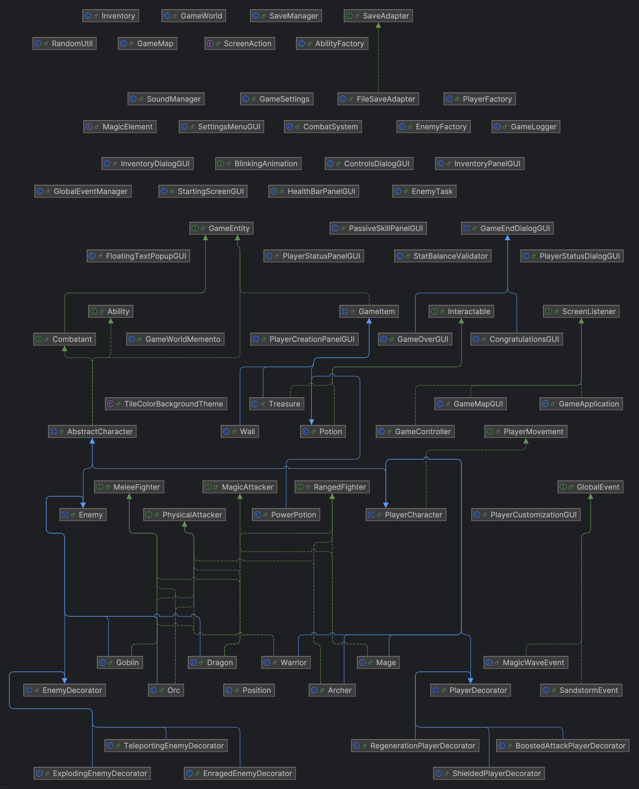

# 🐉 Dungeons & Dragons Inspired - Java Game Project

This repository contains a Java-based implementation of a Dungeons & Dragons-inspired game. It was developed as part of the **Advanced Project Oriented Programming** course at [SCE - Shamoon College of Engineering](https://www.sce.ac.il/).

## 📜 Project Overview

This project simulates a simplified action turn-based role-playing game (ARPG), where players and enemies take actions such as attacking, casting spells, and moving around a game map. The architecture follows object-oriented principles and leverages Java interfaces, inheritance, threading and polymorphism to define different character types and combat behaviors.

---

## 🌟 Key Features

- 🎮 **Up to 4-Player Local Co-op** – Team up and explore a grid-based world together.
- 🛡️ **Flexible Character Creation** – Choose a name and class Customize your Warrior, Archer, or Mage’s stats with a unique attributes and abilities before starting your quest.
- 🗺️ **Customizable Grid** – Start with a grid size of at least 10x10.
- ⚔️ **Turn-Based Combat** – Strategically move, attack, or interact each turn.
- 💥️ **Magic and physical attacks** – Each character class uses distinct attack types with hit chance and evade mechanics
- ✴️ **Floating Damage Numbers** – See color-coded damage values briefly appear above characters when hit, with distinct colors for magic and physical attacks.
- 🧠 **Interactive Entities** – Right-click to inspect enemies, items, or players.
- 🍾 **Item System** – Pick up potions, power potions, and treasure from defeated enemies.
- 🎒 **Inventory & Status Panels** – Use E/middle mouse to manage items, Q for player stats.
- 🧌 **Enemy Types** – Face off against Goblins, Orcs, and mighty Dragons.
- 👾 **Evolving Enemies** – Beware of enemies with unpredictable behaviors—some explode on death, go berserk when hurt, or teleport unexpectedly!
- 🧪 **Endless Adventure Mode** – New enemies spawn endlessly when numbers run low, keeping the challenge alive forever.
- 🌪️ **Global Events** – Random world events like sandstorms that force entity movement or magic waves that damage all characters.
- 🏁 **Game Over Screen** – Endgame summary with a ranked treasure score list.
- 💾 **Save and Load Progress** – Save your adventure mid-game and pick up right where you left off.
- 🧰 **Toggleable UI Panels** – Through the settings menu, players can toggle the visibility of HP bars and side panels that display player status and inventory.
- 📜 **Game Logging System** – Every action (movement, attacks, pickups) is logged in real-time via a background logger.
- 🔊 **Dynamic Sound & Music** – Audio reacts to combat events (e.g., low HP or dragon battles).
- 🎛️ **SFX for UI and Combat** – Button clicks, interactable items and player attacks come with satisfying sound effects for a responsive and immersive experience.
- 🎨 **Customizable Settings** – Change SFX/music volume and grid colors on the fly.
- 📦 **Centralized Resource Management** - All sounds, images, and configuration files are organized in a dedicated resources folder

---

## 📁 Project Structure

```
src/
└── game/
    ├── characters/      # All character types (players and enemies)
    ├── combat/          # Combat logic and attacker interfaces
    ├── core/            # Game entity base classes and inventory system
    ├── engine/          # Game engine and utilities
    ├── global_events/   # Random game-wide effects like sandstorms and magic waves
    ├── gui/             # Graphical user interface components (Swing windows, screens, etc.)
    ├── items/           # In-game items (potions, treasure, etc.)
    ├── logging/         # GameLogger for tracking all game actions
    ├── map/             # Map and position logic
    └── resources/       # Sound, images, config files

```

---

## 🚀 Getting Started

To get a local copy of the project running on your machine, follow these steps:

### 📥 Clone the repository

Use the following command to clone the repository to your local machine:

```bash
git clone https://github.com/JordanDaudu/Dungeons_And_Dragons.git
```

### ⚙️ Setting up the environment

Ensure you have **Java** installed on your machine. You can download it from [here](https://www.oracle.com/java/technologies/javase-jdk11-downloads.html).

For the IDE, you can use **IntelliJ IDEA** or **Eclipse**, which will automatically handle most of the setup for you.

### 🛠️ Build & Run

1. Open the project in your preferred IDE.
2. Set the `resources` folder as a **Resources Root** (see the **Setting Up the `resources` Folder in Your IDE** section).
3. Run the `GameApplication` class to start the game.

---

## 📝 Setting Up the resources Folder in Your IDE

To ensure **sound files**, **images**, and other essential resources load correctly during runtime, it’s **crucial** that your IDE recognizes the resources folder as a **Resources Root**.

### ❗ Why is This Important?
If the resources folder is not properly set, your game may fail to load crucial files like sound effects, images, or configuration files, causing errors or unexpected behavior during gameplay.

---

### 💡 IntelliJ IDEA

There are **two ways** to mark the resources folder correctly:

#### ✅ Option 1: *Using Project View*
1. 🖱️ In the **Project** tool window, right-click the resources folder.
2. 📁 Choose **Mark Directory as** → **Resources Root**.

⚡ This method is quick and convenient.

---

#### ✅ Option 2: *Using Project Structure*
1. ⚙️ Go to **File** → **Project Structure** (or press Ctrl+Alt+Shift+S).
2. 🧩 In the left pane, select **Modules**.
3. 📂 Under the **Sources** tab, locate and **click the resources folder** in the directory tree.
4. 🏷️ At the top of the window, click the **"Resources"** button in the **Mark as** section.
5. 💾 Click **Apply**, then **OK**.

✅ This tells IntelliJ to treat the resources folder as a classpath root for loading files like sound effects and images.

---

### 💡 Eclipse

1. 🖱️ Right-click your project and choose **Properties**.
2. 🧭 Go to **Java Build Path** → **Source** tab.
3. ➕ Click **Add Folder**, then check the resources folder.
4. ✅ Click **OK** and **Apply and Close**.

🗂️ This adds the resources folder to your classpath.

---

## 🖥️ Technologies Used

| Tool / Concept          | Purpose                                                                                                             |
|-------------------------|---------------------------------------------------------------------------------------------------------------------|
| Java                    | Core game logic and backend                                                                                         |
| Java Swing              | GUI components (windows, buttons, panels)                                                                           |
| OOP Principles          | Inheritance, interfaces, and polymorphism for scalable design                                                       |
| Threads                 | Enable concurrent character actions and smoother game flow                                                          |
| Locks (Synchronization) | Manage thread safety during shared resource access (e.g., inventory, combat, map)                                   |
| Design Patterns         | Applied patterns like Singleton, MVC, ThreadPool, Adapter, Factory Method, Builder, Memento, Decorator and Observer |
| Custom Audio Engine     | Handles dynamic sound effects and adaptive background music                                                         |
| IntelliJ / Eclipse      | Development environment and debugging support                                                                       |


---

## 🧠 Implemented Design Patterns

This project showcases a variety of software design patterns to demonstrate modular, scalable, and maintainable architecture:

| Pattern             | Purpose / Usage                                                                                    |
|---------------------|----------------------------------------------------------------------------------------------------|
| **Factory Method**  | Used to create player characters, enemies, and abilities while encapsulating their creation logic. |
| **Builder**         | Enables customizable configuration for PlayerCharacter and Enemy objects.                          |
| **Decorator**       | Adds dynamic behavior to characters during runtime (e.g., shielding, regeneration, explosion).     |
| **Memento**         | Implements saving and loading game state while preserving encapsulation.                           |
| **Singleton**       | Ensures a single instance of key game systems like `GameMap`, `SaveManager`, and `GameLogger`.     |
| **Thread Pool**     | Manages enemy action scheduling for concurrency and automatic enemy replenishment.                 |
| **Observer**        | Used to notify UI components and systems of game state changes, like HP or inventory updates.      |
| **MVC (Model-View-Controller)** | Cleanly separates game data (Model), display (View), and interaction (Controller).                 |
| **Adapter**         | Provides compatibility layers for legacy UI elements or resource loaders.                          |

---

## 🧩 Project Architecture Diagram
To better understand the class structure, relationships, and project flow, here's a visual representation of the game's architecture.<br>
It includes core components of the game file.

**Architecture Diagram**


**Class Diagram**


---

## ⌨️ Controls & Shortcuts

| Key / Action              | Function                                                                          |
|---------------------------|-----------------------------------------------------------------------------------|
| **W / A / S / D**         | Move your character                                                               |
| **Left Click**            | Move to the clicked tile                                                          |
| **E** or **Middle Click** | Open the inventory to use potions and items                                       |
| **Right Click**           | Inspect any entity (player, enemy, or item) for detailed info                     |
| **Q**                     | View player status panel with stats and treasure points                           |
| **ESC**                   | Open settings menu (adjust volume, background color, toggle panels and exit game) |

---

## 🎮 Gameplay Showcase

A visual tour of the game features and interface:

### 🧑‍💼 Starting the Game

**Player & Grid Setup**


> Select the number of players (1–4) and the grid size to begin your adventure.

**Character Creation**


> Enter a character name and choose a class: Warrior, Mage, or Archer.

---

### 🎒 Exploring the World

**Single-Player Movement Demo**  


> Explore the map as a solo adventurer.

**Multiplayer Movement Demo**  


> Multiple players navigating the grid. The game supports 1–4 player gameplay.

**Picking Up Items**  


> Collect potions, treasure, and useful items scattered across the map.

**Right-Click to Inspect**


> Right-clicking on any entity—player, enemy, or item—displays a popup with detailed information including stats, health, and item details. This helps players make more informed decisions during gameplay.

**Showing Inventory**  


> View collected items and manage your inventory.

---

### ⚔️ Combat & Interaction

**Attacking Enemies**  


> Engage in turn-based combat using physical or magical attacks.

**Player Status Window**  


> View player stats, class type, and current treasure points.

**World Events**


> Random global events like magic waves the deals damage and sandstorms that deal damage and move the entities

---

### ⚙️ Game Options

**Settings Menu**  


> Adjust music and sound effect volume, change the grid background color using a dropdown menu, remove panels from game or exit the game via the pause menu.

**Controls Menu**


> Controls can be seen from in-game
---

### 🏁 Endgame

**Game Over Screen**  


> Shown when all players are defeated. This will show the scores of each player in descending order.

---

## ⚖️ Disclaimer & Copyright

This project was developed as a **non-commercial, educational project** for the *Advanced Project Oriented Programming* course at [SCE - Shamoon College of Engineering](https://www.sce.ac.il/). It is intended to demonstrate object-oriented design, game architecture, and Java programming skills.

### Audio & Asset Credits

Some of the sound effects and music tracks used in this project were sourced from popular games such as **Octopath Traveler** and **Persona 5**. These assets are used solely for educational purposes to enhance the learning experience and are **not intended for redistribution, resale, or commercial use**.

If you are the copyright holder of any asset and wish for it to be removed from this repository, please contact me and I will promptly comply.

## 👤 Author

This project was created by **[Jordan Dudu]** – connect with me on [LinkedIn](https://www.linkedin.com/in/jordan-daudu-cpp-python-java/).

---

## 🤝 Special Thanks

Special thanks to [Joe](https://github.com/joe140601) for helpful insights and contributions during development documenting the project, testing and revisioning.
